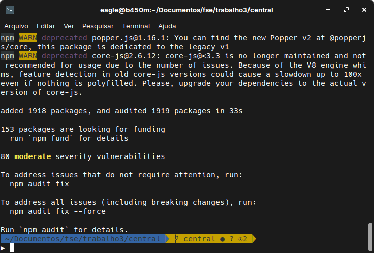
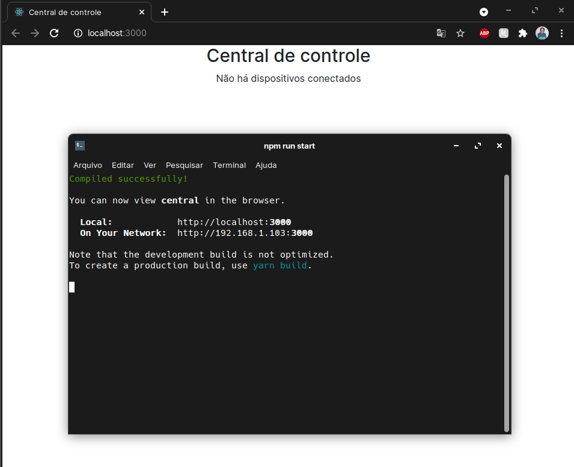
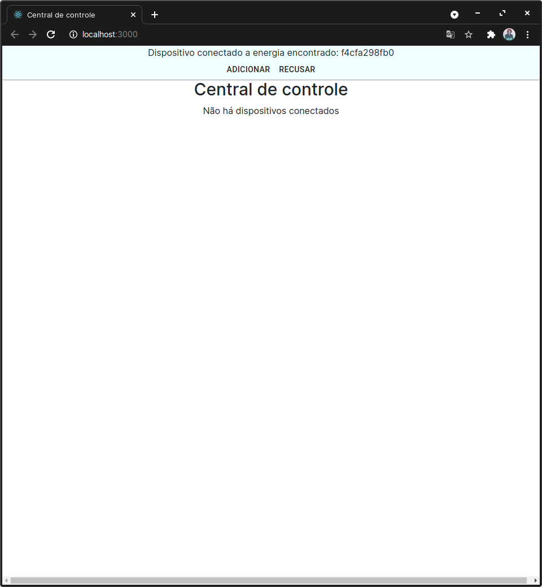
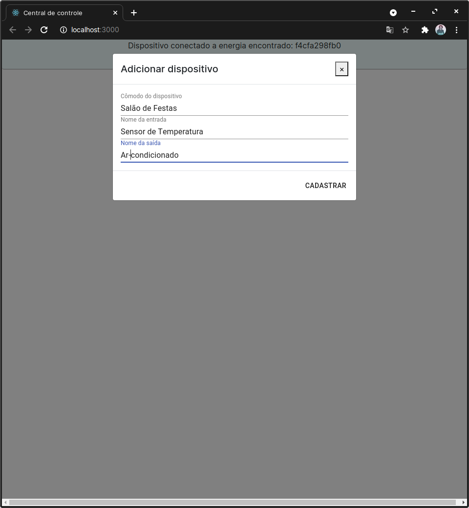
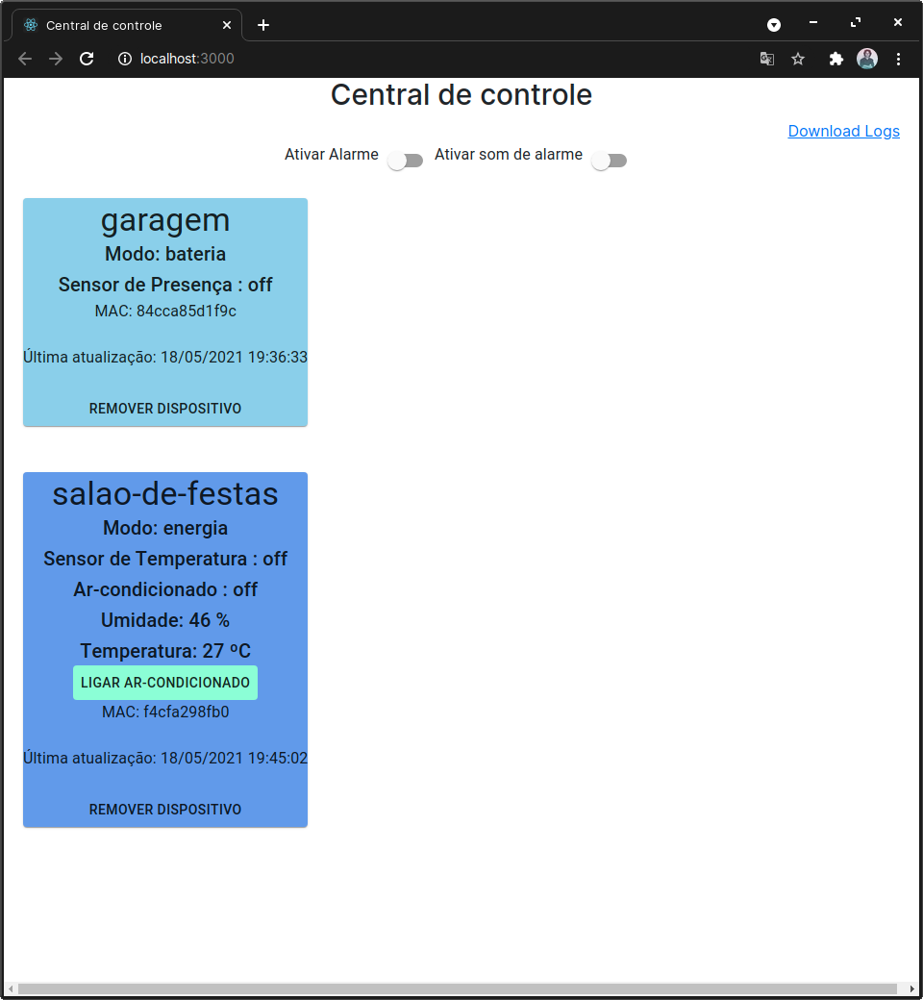
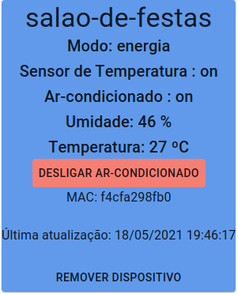
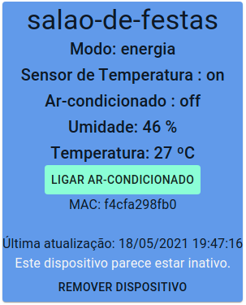
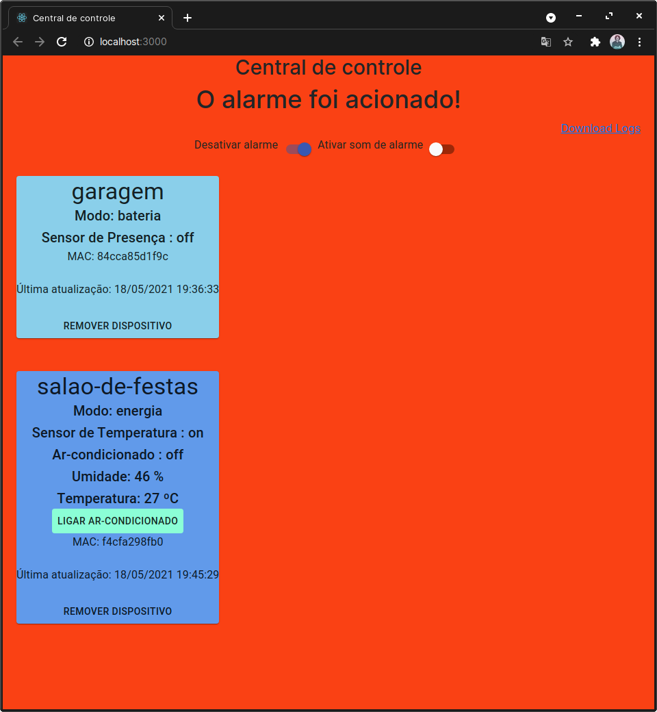

# FSE - Trabalho Final

## Dados

| Aluno | Matrícula |
| --- | --- |
| Pedro Igor | 17/0062635 |
| Alexandre Miguel Rodrigues Nunes Pereira | 16/0000840 |

## Introdução

O Projeto em questao busca realizar a implementação de um sistema de controle, com um computador atuando como um **Sistema Central** e um conjunto de placas ESP-32 atuando como um **Controlador Distribuido**, cada, através de uma conexão  via Wifi por meio do protocolo MQTT, como descrito no repositório do projeto em [https://gitlab.com/fse_fga/projetos_2020_2/trabalho-final-2020-2](https://gitlab.com/fse_fga/projetos_2020_2/trabalho-final-2020-2).

## Dependências

* [Biblioteca ESP32-DHT11](https://github.com/0nism/esp32-DHT11)
* Node na versão 16 ou superior (não testamos em versões inferiores)

## Execução

Para executar o programa basta clonar o repositório presente...

### Servidor Central

``` bash
# Clone do repositório
$ git clone https://github.com/pedroeagle/fse

# Vá para o diretório do projeto do servidor central
$ cd fse/trabalho3/central

# Instalar dependências do projeto.
$ npm install --force #ou yarn install
```
Resultado esperado após a instalação: <br/>


``` bash
# Iniciar a aplicação
$ npm run start #ou yarn run start
```
Resultado esperado após o início da aplicação: <br/>


Será criado um server local e informado a porta em que estará executando. Acessando o host informado é possível acessar a página inicial da central de controle sem dispositivos conectados ainda.

#### ***Painel de controle***
Ao iniciar a esp32 será enviada uma mensagem de inscrição para o seguinte Broker: ```mqtt://broker.emqx.io:1883``` no canal ```fse2020/160000840/dispositivos/${mac_address_da_esp32}```. O servidor central mostrará uma notificação informando que um novo dispositivo foi encontrado além de informações como o modo de funcionamento e o mac address do dispositivo. <br/>
 <br/>

Após aceitar o dispositivo é aberto um modal para a configuração do cômodo além do nomes dos dispositivos de entrada e saída.<br/>
<br/>

Após configurar o dispositivo é aberto um painel com todos os dispositivos conectados além de funcionalidades como "Ativar e desativar alarme", "Ativar e desativar áudio do alarme", "Download dos logs".<br/>
<br/>

É possível visualizar todas as informações do dispositivo tais como o nome do cômodo, o modo, dispositivo de entrada, mac address, horário da última utilização, para dispositivos em modo energia: o dispositivo de saída, umidade, temperatura, um botão para ligar/desligar o dispositivo de saída.<br/>
<br/>

Caso um dispositivo em modo energia fique 30 segundos sem atualizar seus estados é então mostrada uma notificação de inatividade. <br/>
<br/>

Caso o alarme esteja ativado, se um dispositivo de entrada de uma esp32 em qualquer modo for acionado é então disparado um alarme que só pode ser desacionado pelo usuário na central de controle. O alarme deixa a tela vermelha além de tocar um som que pode ser mutado.
<br/>


## Referências

- [Driver da Bosh para o sensor BME280](https://github.com/BoschSensortec/BME280_driver)  
- [Biblioteca BCM2835 - GPIO](http://www.airspayce.com/mikem/bcm2835/)    
- [Biblioteca WiringPi GPIO](http://wiringpi.com)  
- [PWM via WiringPi](https://www.electronicwings.com/raspberry-pi/raspberry-pi-pwm-generation-using-python-and-c)
